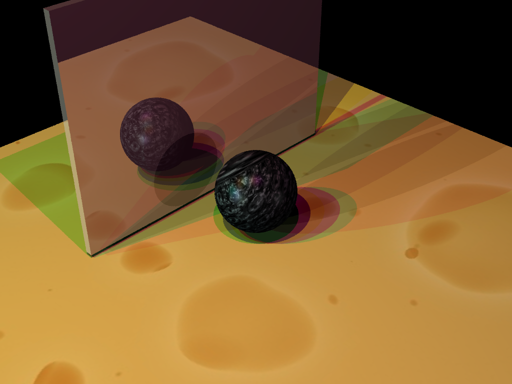
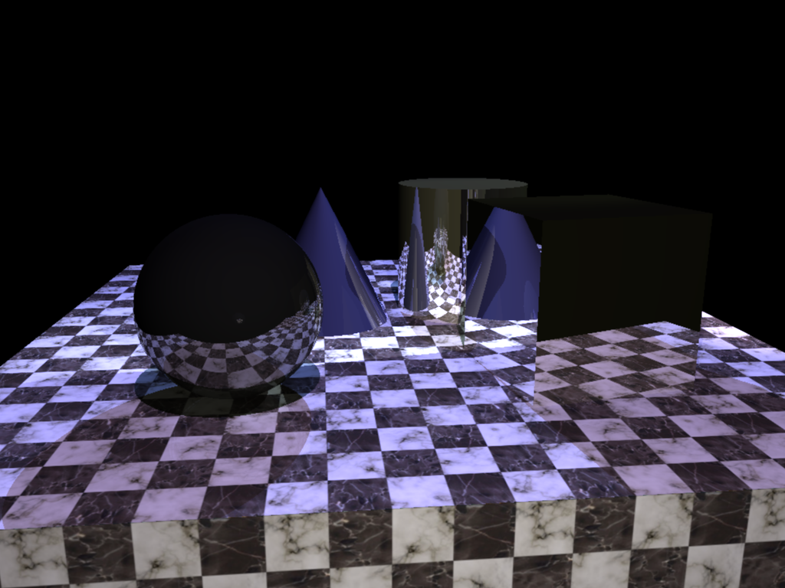
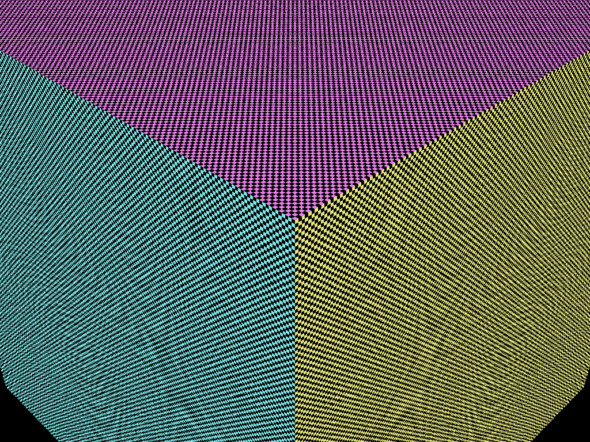
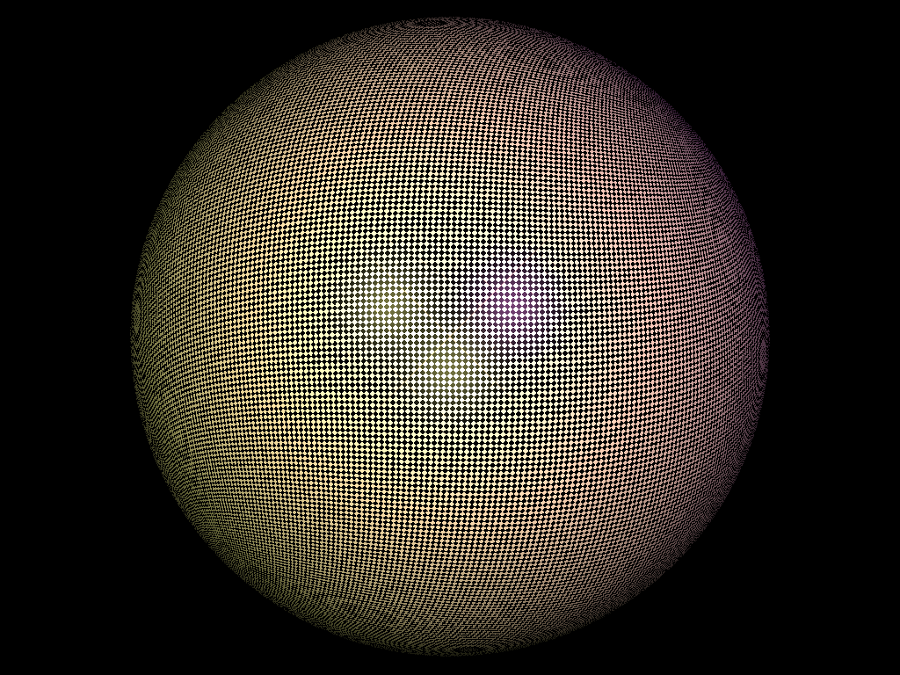
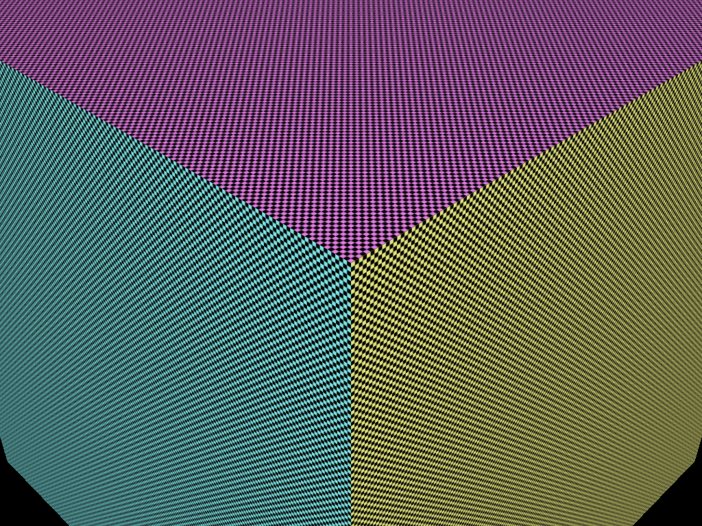
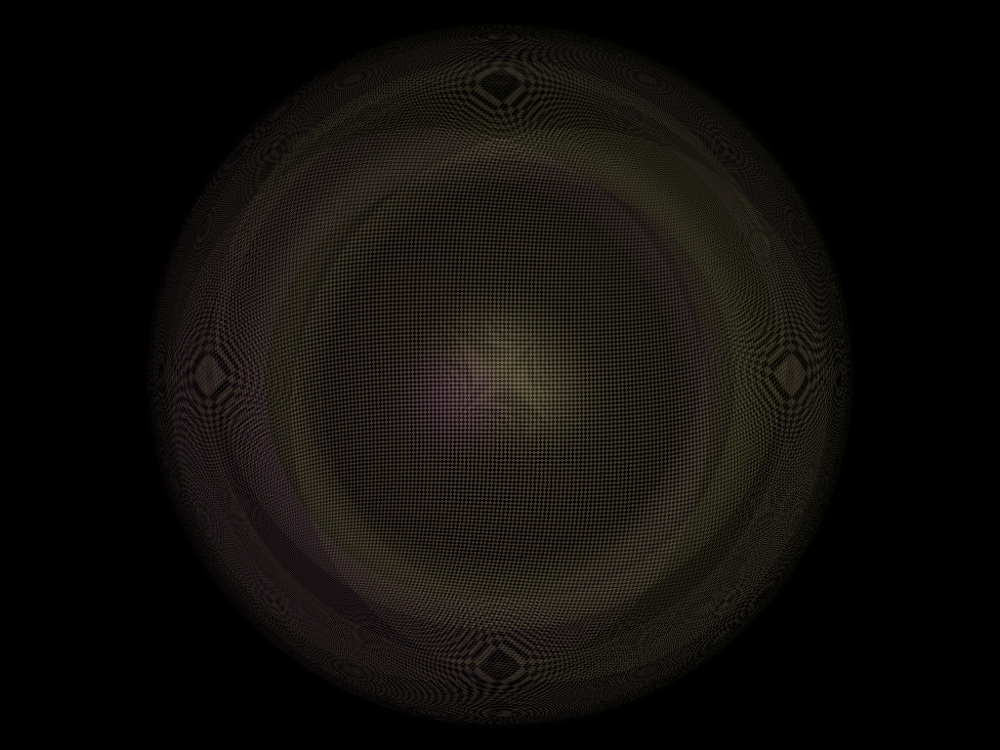
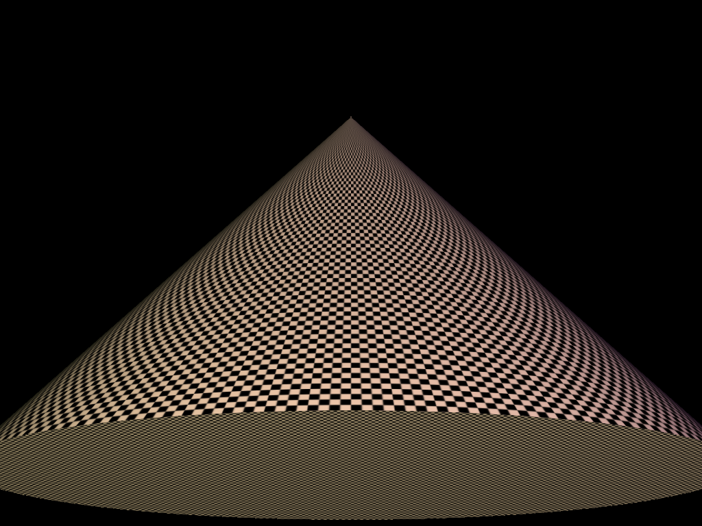
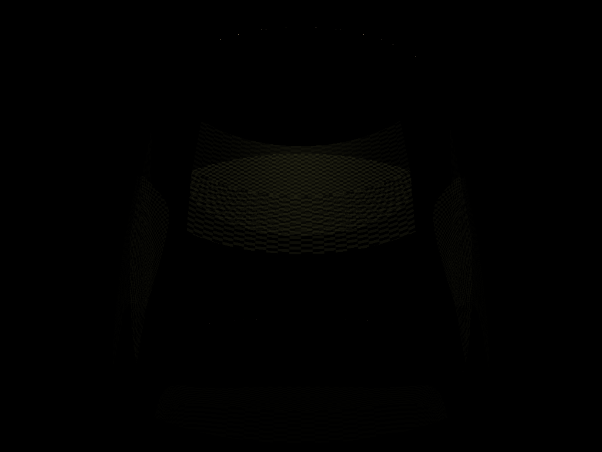
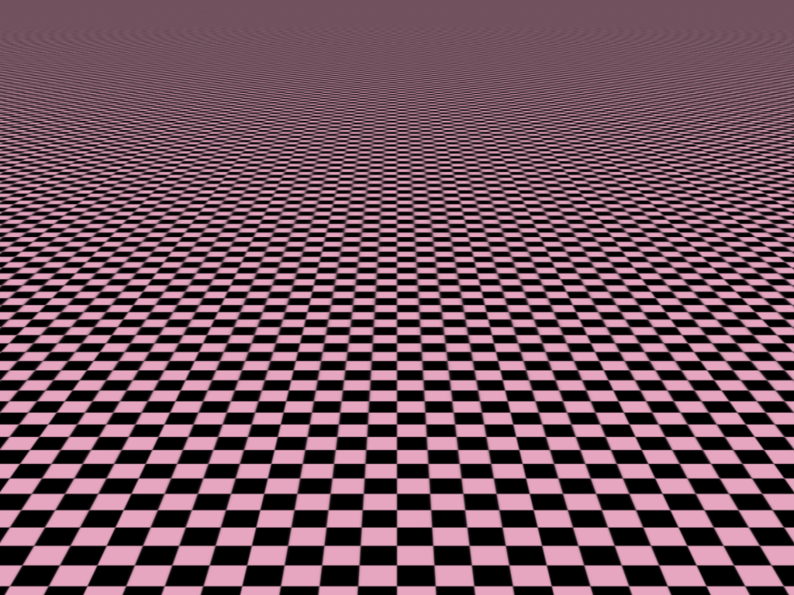

# Project 4: Antialias

Please fill this out for Antialias only. The project handout can be found [here](https://cs1230.graphics/projects/ray/3).

## Output Comparison
Run the program with the specified `.ini` file to compare your output (it should automatically save to the correct path).
> If your program can't find certain files or you aren't seeing your output images appear, make sure to: 
> 1. Set your working directory to the project directory
> 2. Set the command-line argument in Qt Creator to `template_inis/antialias/<ini_file_name>.ini`
> 3. Clone the `scenefiles` submodule. If you forgot to do this when initially cloning this repository, run `git submodule update --init --recursive` in the project directory

> Note: once all images are filled in, the images will be the same size in the expected and student outputs.

| File/Method To Produce Output | Expected Output | Your Output |
| :---------------------------------------: | :--------------------------------------------------: | :-------------------------------------------------: | 
| shadow_test_4spp_grid.ini |   |  |
| shadow_test_4spp_rand.ini |   |  |
| shadow_test_4spp_strat.ini |   |  |
| mirror_primitives_64spp_strat.ini |   |  |
| unit_checkerboard_bilinear.ini |   |  |
| sphere_checkerboard_bilinear.ini |   |  |
| cone_checkerboard_bilinear.ini |   |  |
| cylinder_checkerboard_bilinear.ini |   |  |
| moire_checkerboard_bilinear.ini |   |  |
| unit_checkerboard_trilinear.ini |   |  |
| sphere_checkerboard_trilinear.ini |   |  |
| cone_checkerboard_trilinear.ini |   |  |
| cylinder_checkerboard_trilinear.ini |   |  |
| moire_checkerboard_trilinear.ini |   |  |

## Design Choices

## Collaboration/References

## Known Bugs

## Extra Credit